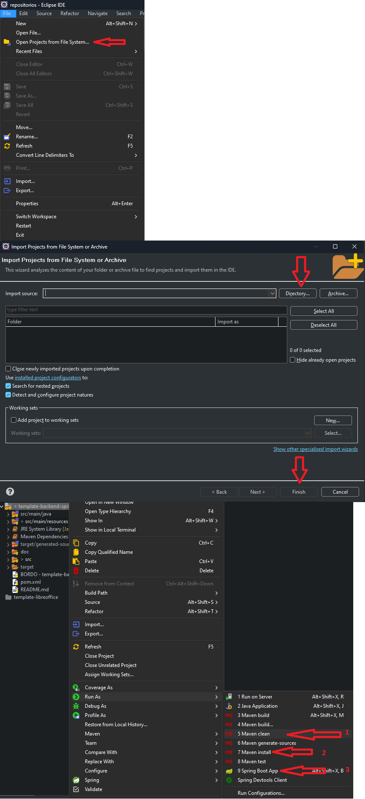

# Resumo

O intuito deste projeto é ajudar a iniciar um novo projeto backend com uso do JasperReport e o framework Spring boot.

<h4> Conteúdo do template:</h4>

- Estruturação das suas pastas seguindo as melhores práticas;
- Controller: 
    - sub-pasta:
        - jasper: controller referentes aos endpoints para geração de relatórios;
            - pasta pojo: classe com as variáveis que serão os fields do arquivo .jrxml.
- Service: 
    - sub-pasta:
        - jasper: concentrará todas as classes Services para a geração de relatórios.

- src/main/resources
    - fonts: pasta com a fonte Carlito que foi adicionada ao projeto.
    - images: concentra as imagens utilizadas pelo projeto.
    - reports: concentra os arquivos de relatório jasperRerport .jrxml

<h4> Estrutura do geral projeto: </h4>

- src/main: pasta principal com duas subpastas.
    - api: que contém o código do projeto; e
    - resources: que contém recursos/arquivos que configuram e/ou são utilizados pela API.
- pom.xml: base de um projeto Maven, contém as informações e as dependências que são importantes para a execução do projeto.

<h2> JasperReport </h2>

- Service: 
    - sub-pasta:
        - jasper: A classe JasperService é um <i>service</i> que obtém os métodos principais para a criação do relatório. 
            - gerandoRelatório: método que gerará o relatório conforme o formato escolhido.
            - compileReport: método que fará a compilação do arquivo .jrxml em .jasper.
            - dadosResultantes: método que irá unificar em HashMap o JRBeanCollectionDataSource com os Parâmetros para serem usados pelo jasper.
            - export: método para exportação do relatório em formato HTML.
- resource:
    - reports: Templates .jrxml dos relatórios.
        - relatorioTreinamentoJasper.jrxml
        - relatorioCalendarioEscala.jrxml
        - relatorioTrigramaUsuarioSubReport.jrxml
        - relatorioTabelaComGrafico.jrxml
        - relatorioUsandoSubreportMarcaDagua.jrxml
        - usandoSubreport.jrxml


<h4> Tecnologias utilizadas: </h4>

- Spring Boot: 3.2.4.
- Banco de dados: h2
- Hibernate
- Swagger
- Lombok
- JasperReports: 6.20.6


# Ambiente de Desenvolvimento

- Eclipse
- Java 17
- Jaspersoft Studio

## Como compilar e executar 

1. Clone o projeto para a sua máquina. Abra um terminal e execute:
```
git clone https://github.com/ThiagoBAlves13/spring-jasper-treinamento.git
```
2. Abra o projeto no Eclipse: File -> Open Projects From File System -> Directory -> Selecionar pasta do projeto e finalizar

3. Instale as dependências do maven: Clique no diretório do projeto com o botão direito vá em _Run As -> Maven clean e depois Run As -> Maven Install_
 **ou** _execute o seguinte comando no terminal_ (na pasta do projeto): 
 ```
    mvn clean e mvn install
 ```

4. Execute usando como aplicação Spring: Clique no projeto com o botão direito -> Run As -> Spring Boot App.

<h5> OBS: Esses passos estão descritos de forma visual no fluxograma abaixo.
 
# spring-jasper-treinamento
